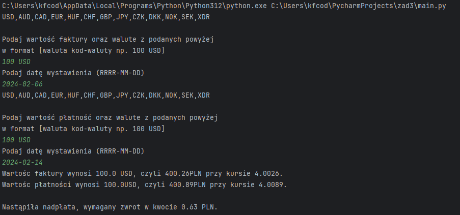

# Zadanie 3 - Raport - Program do obsługi faktur i płatności walutowych


### Wprowadzenie
Program ma za zadanie komunikowanie się z API Narodowego Banku Polskiego i na podstawie wprowadzonych danych o fakturze oraz płatności obliczyć kurs oraz prawidłowość przeprowadzonej płatności.

# Opis programu

## Moduły używane:

- *requests*: Używany do komunikacji z API NBP (Narodowy Bank Polski) w celu uzyskania aktualnych kursów walut.
- *csv*: Używany do zapisywania danych do pliku CSV.
- *datetime*: Używany do manipulacji i sprawdzania dat.
- *os.path*: Używany do sprawdzania istnienia plików.

## Zmienne globalne:

- *code_list*: Lista przechowująca kody walut.

## Funkcje:
- *code_list_select(res)*: Funkcja pobiera kody walut z odpowiedzi API.
- *code_list_create(cl)*: Funkcja tworzy plik codelist.txt i zapisuje w nim listę kodów walut, jeśli plik jeszcze nie istnieje.
- *check(temp)*: Funkcja sprawdza poprawność wprowadzonych danych dotyczących kwoty i waluty.
- *date_check(action, data_action)*: Funkcja pobiera dane dotyczące kwoty i waluty oraz daty, komunikuje się z API, pobiera kurs wymiany walut, oblicza wartość w PLN i zapisuje dane do pliku CSV.
- *interface(text)*: Funkcja służy do interakcji z użytkownikiem, pobiera dane dotyczące kwoty i waluty za pomocą interfejsu tekstowego.


## Główna pętla programu:
- Program w nieskończonej pętli wywołuje funkcję date_check() dwukrotnie, raz dla faktury i raz dla płatności.
- Następnie porównuje wartości faktury i płatności, informując użytkownika o ewentualnej nadpłacie lub niedopłacie.

## Uwagi:
    Kod ten służy do obsługi faktur i płatności walutowych. Wymaga dostępu do internetu, aby pobrać aktualne kursy walut z API NBP.

# Instrukcja:
użytkownik wprowadza kwotę faktury oraz 3 literowy kod np `USD` czy `EUR` który podaje z listy prawidłowy format danych:

    100 USD | 100 usd | 100 Usd

kod oznaczający walute może być wprowadzony z dużych lub małych liter nie ma to znaczenia.

Po podaniu kwoty program poprosi o podanie daty w formacie RRRR-MM-DD np `2023-12-12` lub `2024-02-02`, dni i miesiące niepełne uzupełnić zerami, bank nie wystawia notowań w weekendy i święta, więc podczas podania daty weekendu czy święta program poprosi o ponowne podanie daty.

W tym momencie program pobierze dane walutowe z podanego dnia i zapisze je do pliku jeśli wszystkie dane będą zgodne.

Program ponownie poprosi użytkownika o dane jak powyżej tyle, że w ramach płatności faktury.

Waluta płatności z założenia może być inna niż podana na wystawieniu faktury, program podaje finalną różnicę w PLN. 

Finalnie dane są zapisywane do pliku a użytkownik dostaje informacje czy wartość faktury została opłacona czy trzeba dokonać zwrotu czy też nadpłaty.

## Kod źródłowy

``` python

import requests
import csv
import datetime
import os.path


code_list: list = []


def code_list_select(res):
    clist: list = []
    temp: list = []
    for x in res:
        temp.append(x['rates'])
    for x in temp:
        for y in range(len(x)):
            clist.append(x[y]['code'])
    return clist


def code_list_create(cl):
    communication = requests.get(
        f'https://api.nbp.pl/api/exchangerates/tables/c/?format=json')
    response = communication.json()
    cl.append(code_list_select(response))
    if not os.path.isfile("codelist.txt"):
        with open('codelist.txt', 'w', newline='', encoding='UTF8') as code_file:
            csv.writer(code_file).writerow(cl[0])
            code_file.close()


def check(temp):
    try:
        float(temp[0])
    except IndexError:
        print("Musisz podać wartość")
    except ValueError:
        print("Wartosc musi być liczbą")
    try:
        temp[1].upper().isdigit() or code_list[0].index(temp[1].upper())
    except IndexError:
        print("Musisz podać walute")
    except ValueError:
        print("Błędnie podana waluta albo brak jej na liście")


def date_check(action, data_action):
    data_set: list = []
    value = float(data_action[0])
    currency = data_action[1].upper()
    while True:
        while True:
            try:
                date = input("Podaj datę wystawienia (RRRR-MM-DD)\n")
                datetime.date.fromisoformat(date)
                break
            except ValueError:
                print("[BŁĄD] Nieprawidłowy format danych, proszę podać datę w formacie RRRR-MM-DD")
        try:
            # komunikacja z API
            communication = requests.get(
                f'https://api.nbp.pl/api/exchangerates/rates/c/{currency}/{date}/?format=json')
            response = communication.json()
            exchange_rate = response['rates'][0]['bid']
            value_in_pln = value * exchange_rate

            data_set = [value, currency, exchange_rate, value_in_pln, date]

            with open(action, 'w', newline='', encoding='UTF8') as file:
                writer = csv.writer(file)
                writer.writerow(data_set)
                file.close()

        except ValueError:
            print("[BŁĄD] Brak kursu walut dla danego dnia, proszę wprowadzić inną datę.")

        return data_set


def interface(text):
    while True:
        code_list_create(code_list)
        print(open('codelist.txt').read())
        temp = input(f"Podaj wartość {text} oraz walute z podanych powyżej "
                     f"\nw format [waluta kod-waluty np. 100 USD]\n").split()
        check(temp)

        return temp


while True:

    invoice = date_check("invoices.txt", interface("faktury"))
    payment = date_check("payments.txt", interface("płatność"))
    print(
        f"Wartośc faktury wynosi {invoice[0]} {invoice[1]}, czyli {invoice[3]}PLN przy kursie {invoice[2]}.\n"
        f"Wartośc płatności wynosi {payment[0]}{payment[1]}, czyli {payment[3]}PLN przy kursie {payment[2]}.\n"
    )
    if invoice[3] == payment[3]:
        print(f"Faktura została opłacona w całości.")
    elif invoice[3] < payment[3]:
        print(f"Nastąpiła nadpłata, wymagany zwrot w kwocie",
              round(float(payment[3]) - float(invoice[3]), 2), f"PLN.")
    else:
        print(f"Nastąpiła niedopłata, wymagana dopłata w kwocie",
              round(float(invoice[3]) - float(payment[3]), 2), f"PLN.")

    print("\n\n")

```
## Przykładowy wynik działania programu



> Raport przygotowany przez: [Kamil Franke]
> Data: [15.02.2024]